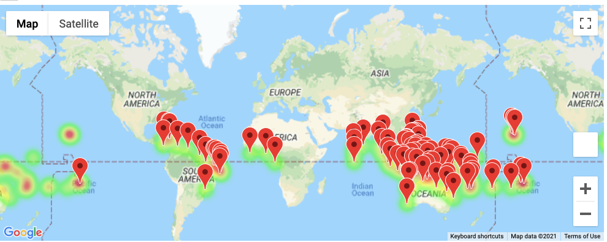
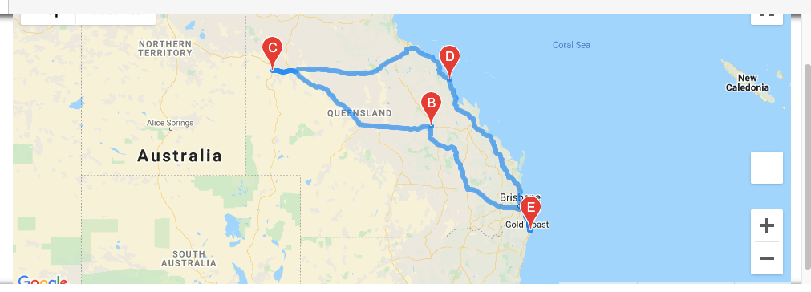
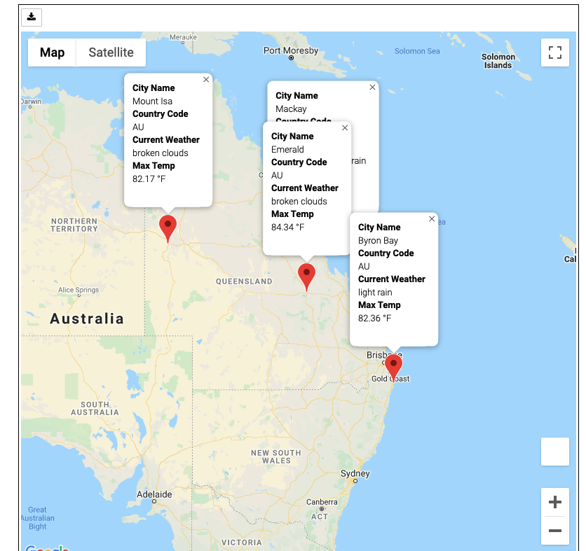

# World Weather Analysis

## Summary

This project utilizes API's to gather weather data for a selection of cities based on the latitude and longitude that are randomly generated.  The set is used to identify cities using the 'citipy' module and using this data, collect the weather data from the city using openweatherapi.org.  This allows us to create a DataFrame containing the weather data that can be used to select cities that meet the users temperature range for planning a vacation.  The dataset is filtered for the cities that meet the users temperature range and presents a map showing the cities that meet the criteria and hotels at each destination.  From this list the user can select a round trip within an area limited to a starting city and 3 destinations which return back to the starting city.  The user is then presented with a map containing the driving route and another map showing the markers for the selected cities which contains information about the city.

---

## Results

### Data set creation and filter

For the trial dataset we created a dataframe containing cities selected from a random generation of 2000 longitude and latitude combinations.  This created a data set of 742 cities that were unique around the globe. This dataset would provide the information to select and create the travel itinerary.  Using this dataset the user is prompted to select a temperature range to find the cities that fall within this range based on their max temperature.  For this dataset we used a range between 80F and 95F.  This gave us a set of 92 cities that met the criteria.  These cities were marked on the map as seen below:

### Travel itinerary and route creation

To create the travel itinerary the user selects 4 cities from the dataset with the starting city also being the ending city.  The other 3 cities act as waypoints along the trip.  Once selected and entered into the code the route map is created using gmaps API.  This map then has markers placed on the cities that were selected and information on each city is available when the marker is selected.  Examples of the maps created are shown below:

#### Route map

#### Marker map

---

## Conclusion

This project shows how the use of API's can access a wide range of data and allow users to filter and sort the data in a meaningful way using some basic code.  This project could create a basic user interface that could automate some of the coding requirements and provide a tool that is easy to use and insightful.

---

